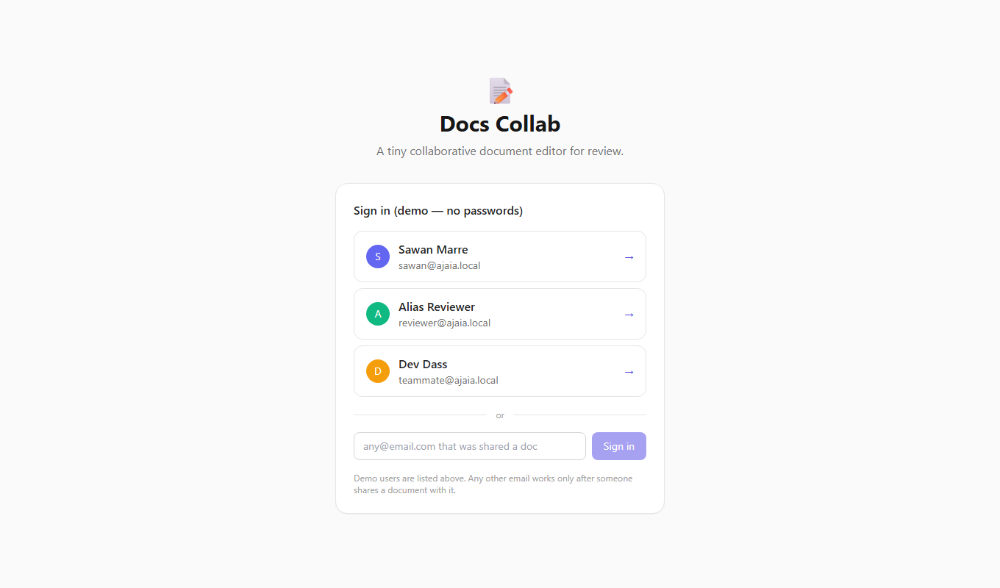
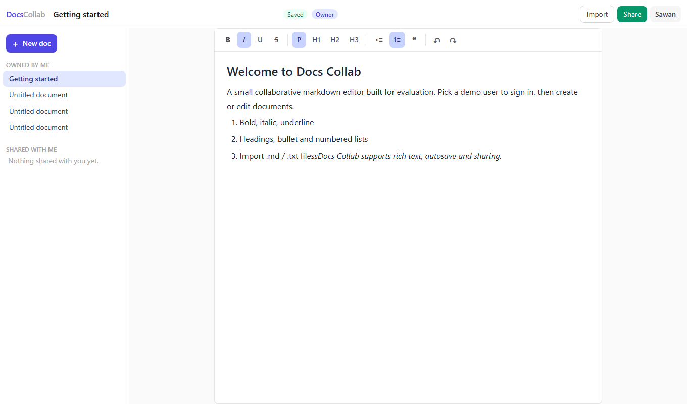
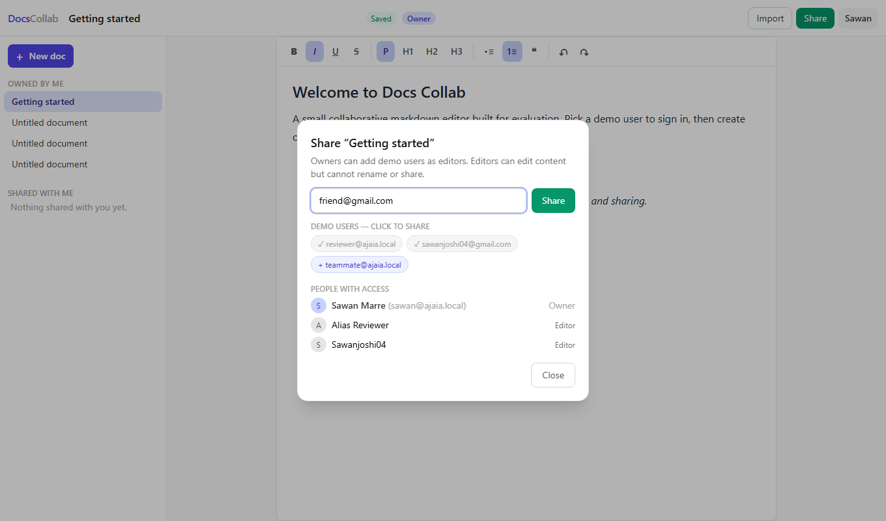
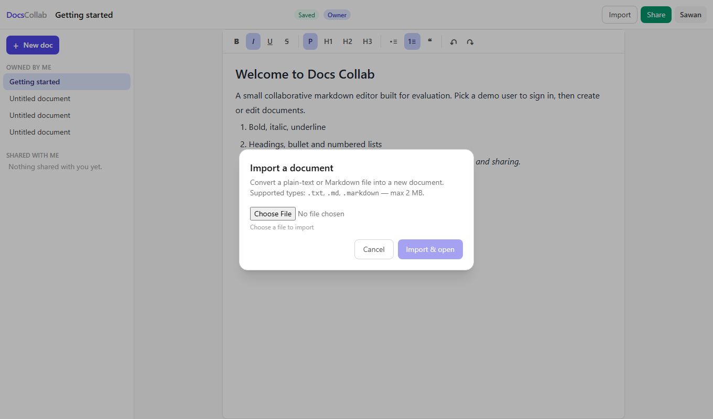
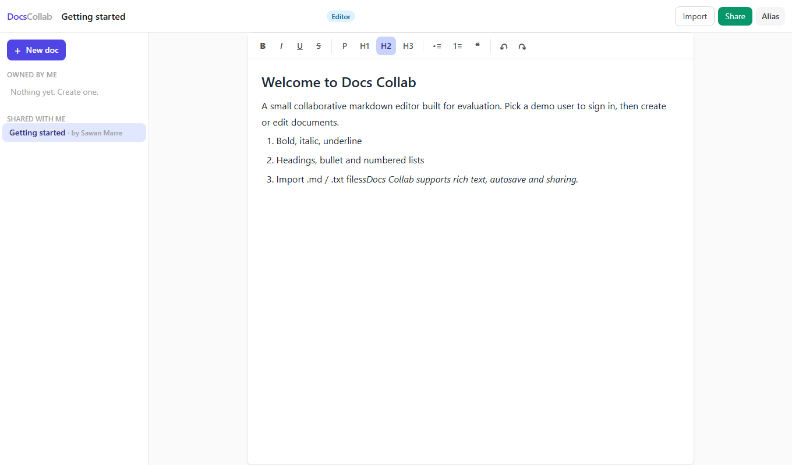

# Docs Collab

A small collaborative document editor inspired by Google Docs, built for the Ajaia LLC assignment.
It focuses on the highest-value slice: create and rename documents, rich-text editing (bold,
italic, underline, headings, bullet/numbered lists) with autosave, Markdown / plain-text import,
and per-document sharing between seeded demo users.

It is **not** a Google Docs clone. There is no real-time collaboration, comments, version history, or
enterprise permission model. See [SUBMISSION.md](./SUBMISSION.md) for the honest scope.

## Screenshots

**Login (demo users + any shared email)**



**Editor with autosave, role badge and toolbar**



**Share modal (demo-user chips + any email invite)**



**File import**



**Reviewer's view — "Shared with me" + Editor badge**



---

## Stack

| Layer | Choice |
|---|---|
| Frontend | React + Vite + Tailwind CSS |
| Rich text | Tiptap (v2, StarterKit + Underline + Strike extensions) |
| Backend | Node.js + Express (JS module, `node:`) |
| Database | SQLite via Prisma ORM |
| Uploads | Multer (in-memory, 2 MB limit) |
| Markdown import | `marked` |
| Tests | Vitest + Supertest (integration tests against a throwaway SQLite) |
| Serving | Express serves the built React app in production (one process) |

**Deliberate tradeoffs** (detailed in [ARCHITECTURE.md](./ARCHITECTURE.md)):

- **Mock auth**: the token is the user's id. Demo users only. No passwords, no sessions.
- **Content is stored as JSON by default, HTML on import.** Tiptap reads/writes the ProseMirror JSON
  document format. Imported files are stored as HTML until the document is next saved in the editor.
- **All shared users are editors.** Owners rename and share; editors edit content. There is a single
  `role` column ready for `viewer`, but only `owner`/`editor` are enforced.
- **No delete.** Deleting documents was deliberately cut from the milestone. See SUBMISSION.md.

---

## Project layout

```
test/
├── server/                 Express API (Prisma, routes, seed, tests)
│   ├── prisma/schema.prisma
│   ├── src/
│   │   ├── app.js          createApp() — API only, importable by tests
│   │   ├── server.js        entrypoint: mounts static client build
│   │   ├── db.js            shared PrismaClient
│   │   ├── middleware.js     Bearer-token auth
│   │   ├── routes/          auth / documents / import
│   │   └── seed.js          creates 3 demo users + a starter doc
│   ├── tests/api.test.js    8 integration tests
│   └── .env                 DATABASE_URL + PORT (gitignored)
├── client/                  React + Tiptap UI
│   ├── src/App.jsx
│   ├── src/api.js
│   ├── src/components/      Sidebar, TopBar, Editor, LoginScreen, modals, toasts
│   └── vite.config.js       dev-server proxy to :4000
├── README.md
├── ARCHITECTURE.md
├── AI_WORKFLOW.md
├── SUBMISSION.md
└── walkthrough-video.txt
```

---

## Prerequisites

- Node.js 20+ (tested on Node 24)

## Run locally (the quick path)

Start the API in one terminal:

```powershell
cd test/server
npm install            # first time only
npm run prisma:push    # first time only (creates server/dev.db)
npm run seed           # first time only (demo users + starter doc)
npm run dev            # serves API on :4000 AND the built client
```

Then open **http://localhost:4000** in a browser.

If `client/dist` is missing (fresh clone), build it first:

```powershell
cd test/client
npm install
npm run build
```

Then restart the server — it auto-detects the new build at startup.

### Run locally, the two-process path

- Start the API only: `cd test/server && npm run dev`
- Start the Vite dev server: `cd test/client && npm run dev`
- Open **http://localhost:5173** — Vite proxies `/api/*` to `:4000`, so the UI works even though
  the Express process is serving the API on a different port.

---

## Tests

```powershell
cd test/server
npm run test
```

Runs 8 integration tests against an isolated `test.db` (created by `tests/setup.js`, deleted
automatically). Covers: login, current-user identity, document create/rename/edit/reopen with
content intact, validation, sharing to a second user, editor write access + rename denial, outsider
denial, sharing without ownership, and `.md`/`.txt` import + file-type rejection.

---

## Demo accounts (seeded)

| Email | Name |
|---|---|
| `sawan@ajaia.local` | Sawan Maranker |
| `reviewer@ajaia.local` | Celia Reviewer |
| `teammate@ajaia.local` | Dev Dass |

No passwords. Sign in from the demo chooser, **or type any email** in the input below the list.
The three demo users are seeded; any other email works after someone shares a document with it
(the share flow auto-creates the user). The seeded **Getting started** doc is owned by `sawan`
and shared with `reviewer`.

## Manual sharing flow (README version)

1. Sign in as **sawan@ajaia.local**.
2. In a document you own, click **Share** → either click a demo-user chip, or type **any email**
   (e.g. `friend@gmail.com`) → Share. Unknown emails are auto-registered as new users.
3. Sign out (user menu, top right) → sign in with that same email via the input box on the login
   screen — the doc now appears under **Shared with me**, with an
   **Editor** badge. Editors can edit content but cannot rename or share.
4. Sign in as a third user that was never shared anything — the doc is absent entirely, and opening
   its URL returns "Document not found."

---

## API

| Method | Path | Purpose |
|---|---|---|
| `POST` | `/api/auth/login` | `{email}` → `{token,user}` (token = user id) |
| `GET` | `/api/auth/me` | current user from `Authorization: Bearer <token>` |
| `GET` | `/api/documents` | `{owned:[], shared:[]}` for the viewer |
| `POST` | `/api/documents` | create `{title}` (owner) |
| `GET` | `/api/documents/:id` | fetch one; `role` + `shares` included |
| `PATCH` | `/api/documents/:id` | rename (owner) and/or set `content` (owner or editor) |
| `POST` | `/api/documents/:id/share` | grant a seeded (or any registered) user editor access (owner only) |
| `POST` | `/api/import` | multipart `file` → new document (`.txt`, `.md`, `.markdown`) |

Any request without a valid Bearer token returns `401`. Unknown document ids and non-shared
documents both return `404` (do not leak existence). Owner-only actions return `403`.

## Validation & error handling

- Title must be a non-empty string (server + client).
- Import route rejects unsupported types and files over 2 MB; Multer errors map to `400`.
- A single JSON error envelope `{ "error": "message" }` with a friendly toast in the UI.
- JSON body limit is 2 MB.

## Deploying

The server serves the built client from `client/dist`, so one free Node host is enough.

### Deploy to Render (free tier, ~10 minutes)

1. Push this repo to GitHub.
2. On [render.com](https://render.com) → **New → Web Service** → connect the repo.
3. Settings:
   - **Runtime**: Node
   - **Build Command**: `cd client && npm install && npm run build && cd ../server && npm install && npx prisma generate`
   - **Start Command**: `cd server && npm start`
   - **Environment variables**: `DATABASE_URL=file:./prisma/dev.db`, `PORT=4000` (Render injects `PORT`; the app reads it)
4. `npm start` runs `prisma db push` + `seed` before booting, so every fresh instance has the demo
   users and the "Getting started" doc.

**Caveat (documented honestly):** Render's free tier has an ephemeral disk — documents created by
reviewers reset on redeploy/restart. For a review window this is fine (seed data always present);
for real persistence, attach a Render Disk or swap `DATABASE_URL` to a free Postgres (Supabase/
Neon) — Prisma needs only a provider change.

### Deploy anywhere else

Any Node host that can run `npm run build` (client) + `npm start` (server) works. No paid
services are required anywhere in this project.